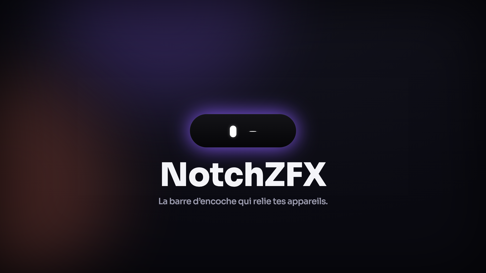
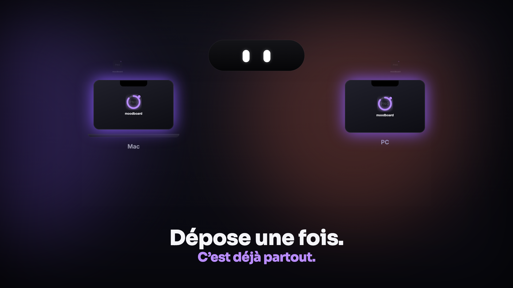
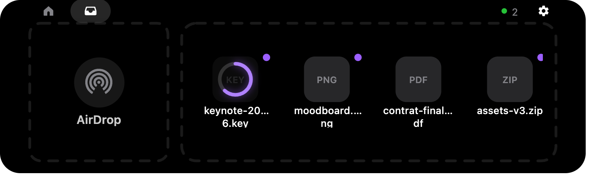
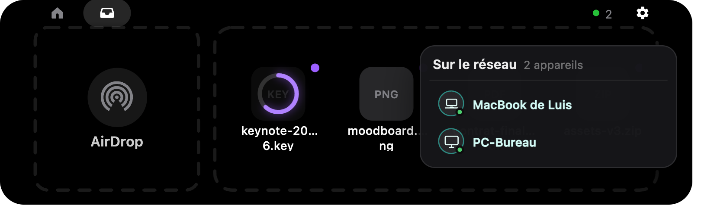
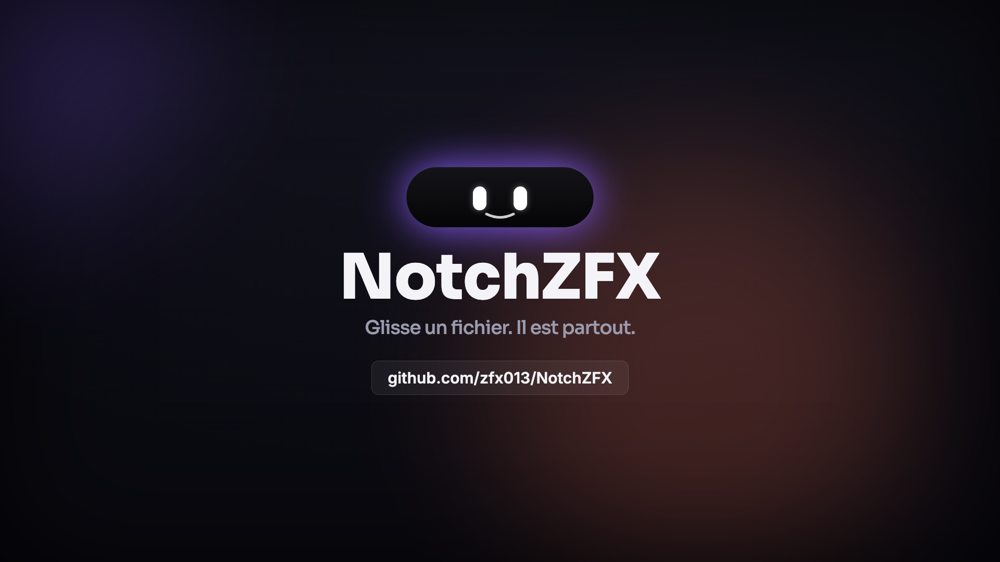

<div align="center">



# NotchZFX 😉

**La barre d'encoche qui relie tes appareils.**
Glisse un fichier. Il apparaît instantanément sur toutes tes machines du même réseau — Mac **et** PC.

[](https://github.com/zfx013/NotchZFX/releases/latest)
[](#-télécharger)
[](#-télécharger)
[](https://www.electronjs.org/)

### ▶️ [Regarder la démo (vidéo, 41 s)](docs/media/notchzfx-promo.mp4)

<a href="docs/media/notchzfx-promo.mp4">
  
</a>

</div>

---

## ✨ Le principe

NotchZFX transforme l'encoche de ton écran en **bibliothèque commune** partagée sur ton réseau local.

- **Tu déposes un fichier** dans l'encoche (drag & drop) → il est **copié automatiquement** sur tous les appareils allumés du même réseau.
- **Tout le monde a les mêmes fichiers.** Aucune sélection, aucun destinataire à choisir, aucun réglage.
- Ça marche **entre Mac et Windows**, sans cloud, sans compte : tout reste sur ton LAN.

<div align="center">

</div>

## 🎬 Ce que ça fait

| | |
|---|---|
| 🗂️ **Bibliothèque commune** | Dépose une fois, c'est partout. Copie automatique vers tous les appareils du réseau. |
| ⏳ **Anneau de progression** | Le fichier apparaît **dès le début** du transfert, avec un anneau qui se remplit (façon App Store). |
| 🟣 **Fichiers reçus repérables** | Anneau et pastille **violets** + le nom de l'expéditeur au clic droit. |
| 🧹 **Vider partout** | Vide la bibliothèque d'un côté → elle se vide sur tous les appareils. |
| 👀 **Voir le réseau** | Une pastille discrète compte les appareils en ligne ; survole-la pour la liste (lecture seule). |
| 🔔 **Notif sans texte** | Une pulsation violette de l'encoche quand un fichier arrive. |
| 🔄 **Mise à jour intégrée** | L'app détecte, télécharge et installe les nouvelles versions toute seule, puis se relance. |
| 🍎 **Bonus macOS** | Lecteur « now playing », calendrier, jauges volume/luminosité, AirDrop. |

<div align="center">

</div>

## 📥 Télécharger

> Dernière version : **v0.2.1**

| Plateforme | Fichier |
|---|---|
| 🍎 **macOS** (Apple Silicon) | [`NotchZFX-0.2.1-mac.zip`](https://github.com/zfx013/NotchZFX/releases/latest/download/NotchZFX-0.2.1-mac.zip) |
| 🪟 **Windows** (Intel/AMD) | [`NotchZFX-0.2.1-win-x64.zip`](https://github.com/zfx013/NotchZFX/releases/latest/download/NotchZFX-0.2.1-win-x64.zip) |
| 🪟 **Windows** (ARM64) | [`NotchZFX-0.2.1-win-arm64.zip`](https://github.com/zfx013/NotchZFX/releases/latest/download/NotchZFX-0.2.1-win-arm64.zip) |

👉 Ou va sur la **[page des Releases](https://github.com/zfx013/NotchZFX/releases/latest)**.

**Installation** — dézippe puis lance l'app. C'est un binaire **non signé** :
- **macOS** : clic droit → *Ouvrir* la première fois (Gatekeeper).
- **Windows** : *Informations complémentaires → Exécuter quand même* (SmartScreen). Autorise le réseau **privé** quand le pare-feu le demande.

## ⚙️ Comment ça marche

- **Découverte** : chaque appareil s'annonce en **broadcast UDP** (port 8788) toutes les 3 s ; il disparaît de la liste après 10 s de silence.
- **Transfert** : **HTTP direct** de pair à pair (port 8787), en streaming (taille illimitée), avec un anneau de progression en temps réel.
- **Sécurité** : réception ouverte aux appareils du **même réseau local** par défaut (le broadcast ne franchit pas les routeurs). Réglable (`paired` / `nobody`).
- **Zéro cloud** : rien ne sort de ton réseau. Aucun compte, aucun serveur tiers.

> ℹ️ La découverte est **locale au sous-réseau**. Certains WiFi publics (« isolation client ») bloquent le pair-à-pair — utilise un réseau de confiance.

## 🪟 Sur Windows

Windows se concentre sur **le partage de fichiers** (le cœur de NotchZFX). L'encoche y est **compacte** (façon écran externe). Le lecteur média, le calendrier et les jauges système sont **spécifiques à macOS** et ne sont donc pas activés sur Windows.

## 🛠️ Compiler depuis les sources

```bash
npm install
npm start            # lancer en dev
npm run package:mac  # build macOS (.app signé localement)
npx electron-builder --win zip --x64 --arm64   # builds Windows
```

## 📜 Licence

Voir [LICENSE](LICENSE).

<div align="center">
<br>

</div>
